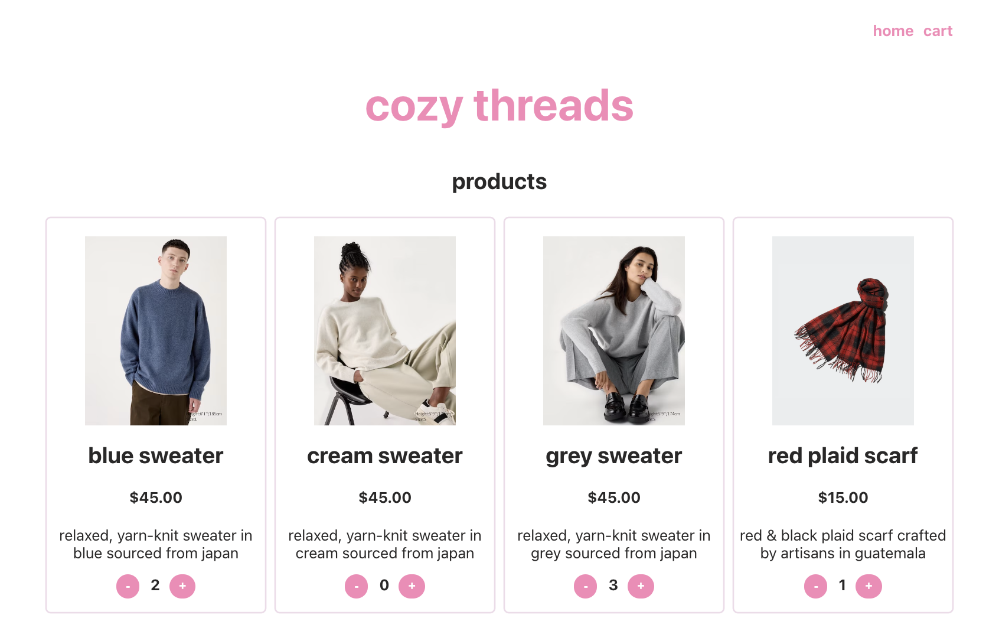

# cozy-threads

### about 
*Cozy Threads* is a direct-to-consumer e-commerce site with a thoughtfully curated collection of ethically and sustainably sourced apparel and accessories. 
**Website:** (https://cozy-threads-seven.vercel.app/)

## features
- From the ***Home page***, add, remove, and update quantities of any items you wish to purchase. These items are stored in cart.
- Efficient list-view of items in cart on the ***Cart page*** allows the user to view products & quantities of items in cart. From the cart page, the user can then **checkout**.
- The Stripe Payments API is integrated at checkout for a seamless shopping experience. At checkout, you can update the quantities of items in your cart.
- This site dynamically displays products in a grid. Upon decreasing browser width, less products will display per row.
- Error handling for when there are no items in cart (user is not allowed to checkout) and when item quantity is decreased past zero (quantity remains nonnegative, at zero).

## to run locally:
Clone the repo locally. Create a `.env file`, and variable `REACT_APP_STRIPE_KEY` to hold the Stripe test api key. This key can be obtained from the [Stripe developer dashboard](https://dashboard.stripe.com/test/apikeys). Once set up, run `npm install && npm start` in terminal to launch the application.